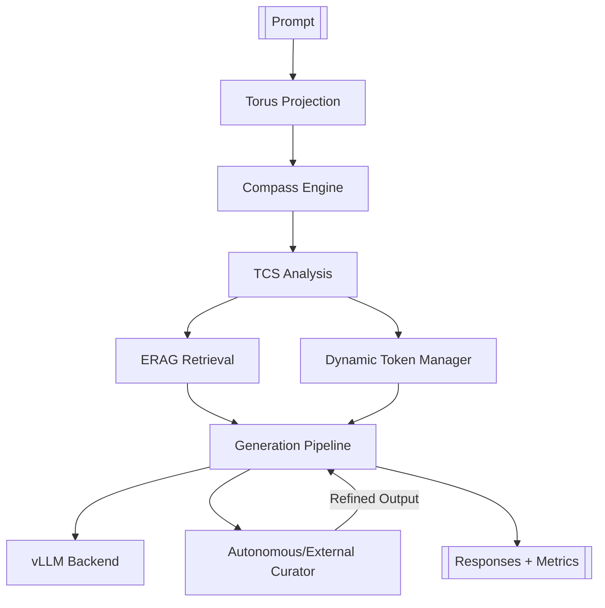

## Prerequisites

- Rust toolchain (`rustup`, `cargo`) pinned to Rust 1.87
- Running inference services (defaults shown):
  - `VLLM_ENDPOINT` → `http://127.0.0.1:5001`
  - `QDRANT_URL` → `http://127.0.0.1:6333`
- Optional curator service when `ENABLE_CURATOR=1` (e.g. Ollama)
- Tokenizer JSON on disk (`TOKENIZER_JSON`)
- Optional: `RNG_SEED` for deterministic runs

## Quick Start

```bash
cd Niodoo-TCS-Release

# Build everything
cargo build --release

# Baseline (raw vLLM)
cargo run --release --bin rut_gauntlet_baseline -- --output-dir logs/baseline_run

# Full NIODOO stack (autonomous curator)
ENABLE_CURATOR=0 CURATOR_AUTONOMOUS=1 \
RNG_SEED=12345 \
cargo run --release --bin rut_gauntlet --features gauntlet -- --output-dir logs/niodoo_run

# External curator example
ENABLE_CURATOR=1 CURATOR_AUTONOMOUS=0 \
CURATOR_QUALITY_THRESHOLD=0.85 \
cargo run --release --bin rut_gauntlet --features gauntlet -- --output-dir logs/curator_run
```

Artifacts (CSV, JSON summary, plots) land under the chosen `--output-dir`.

## Architecture Overview



## Determinism

- `RNG_SEED` seeds the global RNG via `util::seed_manager`
- Logged seed ensures reproducible runs
- `PHASE2_*`, `BREAKTHROUGH_*`, and other knobs remain environment-driven

## Comparing Baseline vs NIODOO

- `rut_gauntlet_baseline_results.csv` (raw model) vs `rut_gauntlet_results.csv` (full stack) in `release_artifacts/`
- Baseline tracks latency + ROUGE-L; NIODOO adds entropy, breakthroughs, learning events, compass quadrants

## Attribution & License

- Attribution requirements are documented in `ATTRIBUTIONS.md`
- License: Prosperity Public License 3.0.0 (see `LICENSE`)
