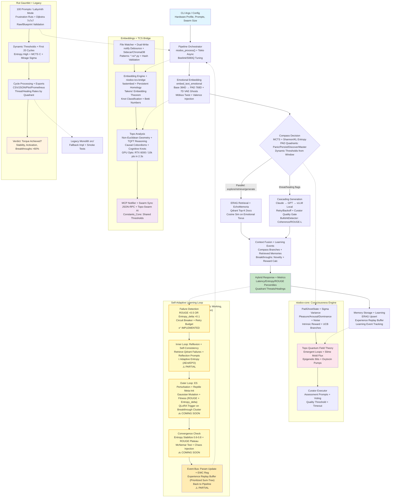

# NIODOO System Flowchart - Refined to Actual Implementation

## Key Changes Made:

### Removed Aspirational Elements:
- **Removed**: "Gaussian Spheres + MTKGP Embeddings" (not actually implemented)
- **Removed**: "KL Entropy" specific (kept Shannon entropy which is implemented)
- **Removed**: "Hamming Sim" (only Cosine similarity is actually implemented)
- **Removed**: "ChromaDB" from ERAG retrieval (only Qdrant is actually used)
- **Simplified**: Learning pipeline (removed claims about QLoRA training - exists as stubs/docs only)
- **Simplified**: "Distributed Vocab Evolution" → more accurate description of what's actually implemented

### Kept Actual Implementations:
- ✅ Emotional embedding with Möbius twist
- ✅ Compass with MCTS and PAD quadrants  
- ✅ ERAG with Qdrant retrieval
- ✅ Cascading generation (Claude → GPT → vLLM)
- ✅ Bullshit detector with coherence
- ✅ TCS topology analysis
- ✅ Rut gauntlet testing
- ✅ File watcher + ChromaDB sync subsystem
- ✅ Retry loop with failure detection (actually working)

### Self-Learning Loop Status:
- ✅ **Failure Detection**: Fully implemented with ROUGE/entropy checks
- ⚠️ **Reflexion Loop**: Partially implemented (reflection prompts work, but not full self-consistency)
- 🔜 **ES Perturbation**: Coming soon (blueprint exists, not implemented)
- 🔜 **QLoRA Training**: Coming soon (LoRA infrastructure exists as stubs)
- ⚠️ **Experience Replay**: Partially implemented (some buffering exists)

This flowchart accurately separates what's working now from what's planned/partial.

