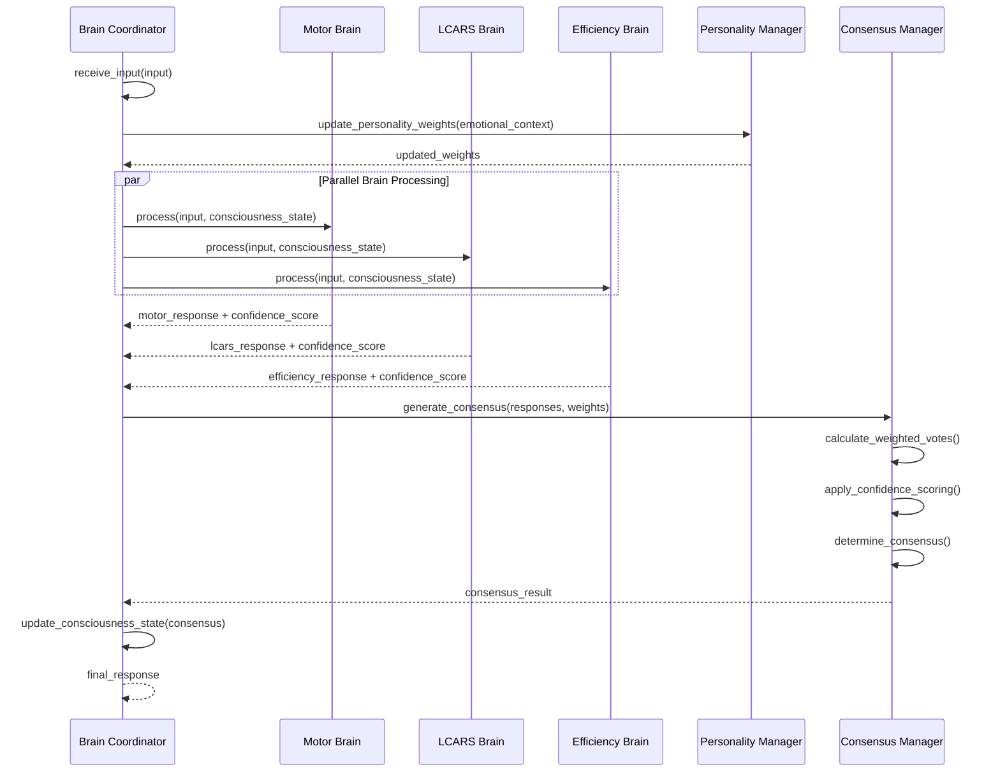
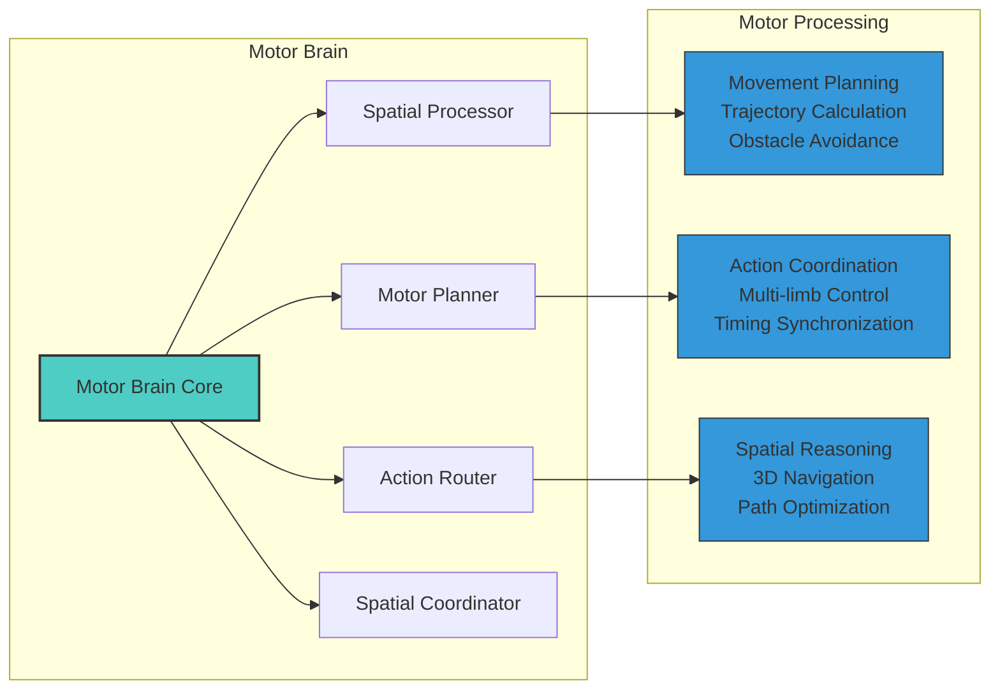
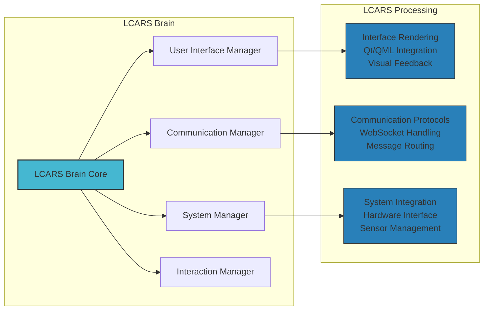
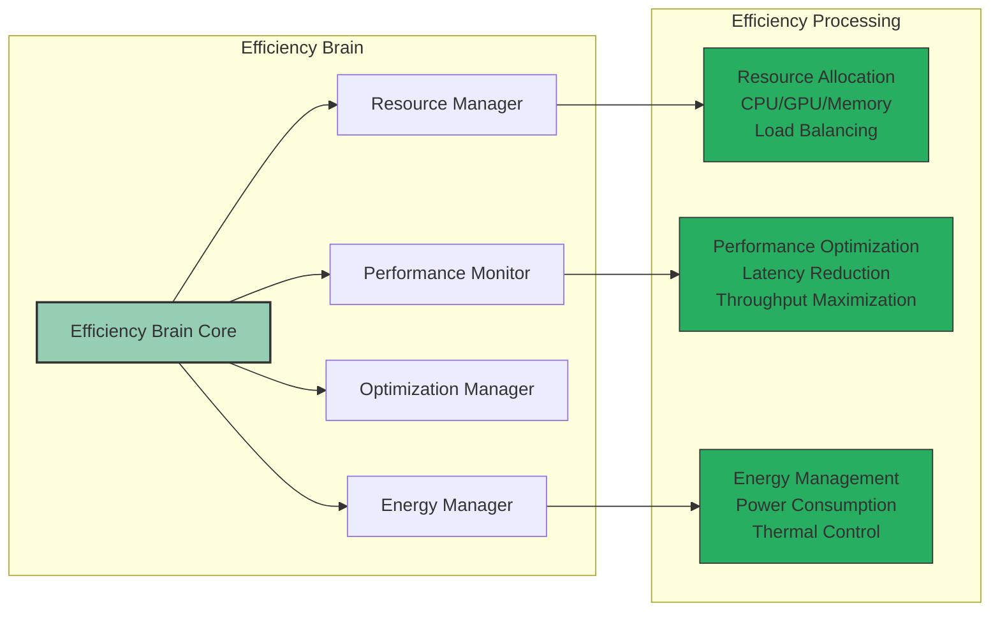
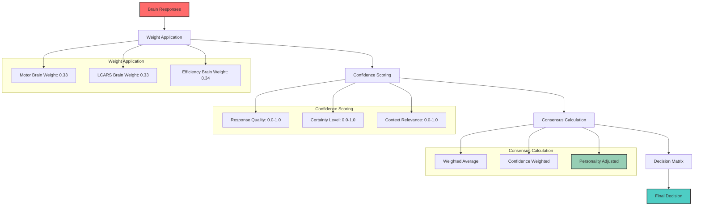

# 🧠 Brain Coordination System Architecture

**Created by Jason Van Pham | Niodoo Framework | 2025**

## Overview

The Brain Coordination System manages the three-brain architecture that processes consciousness events in parallel, enabling sophisticated decision-making through consensus mechanisms.

## Brain Coordination Architecture

```mermaid
graph TB
    subgraph "Brain Coordinator"
        BC[Brain Coordinator]
        PM[Personality Manager]
        CS[Consciousness State]
        EB[Event Broadcaster]
    end
    
    subgraph "Three-Brain System"
        MB[Motor Brain<br/>Action & Movement<br/>Spatial Reasoning<br/>Motor Planning]
        LB[LCARS Brain<br/>Interface & Communication<br/>User Interaction<br/>System Interface]
        EB[Efficiency Brain<br/>Resource Optimization<br/>Performance Tuning<br/>Energy Management]
    end
    
    subgraph "Personality Consensus System"
        P1[Personality 1<br/>Weight: 0.1<br/>Type: Analytical]
        P2[Personality 2<br/>Weight: 0.15<br/>Type: Creative]
        P3[Personality 3<br/>Weight: 0.12<br/>Type: Empathetic]
        P4[Personality 4<br/>Weight: 0.08<br/>Type: Logical]
        P5[Personality 5<br/>Weight: 0.11<br/>Type: Intuitive]
        P6[Personality 6<br/>Weight: 0.09<br/>Type: Practical]
        P7[Personality 7<br/>Weight: 0.13<br/>Type: Strategic]
        P8[Personality 8<br/>Weight: 0.07<br/>Type: Tactical]
        P9[Personality 9<br/>Weight: 0.10<br/>Type: Diplomatic]
        P10[Personality 10<br/>Weight: 0.05<br/>Type: Technical]
        P11[Personality 11<br/>Weight: 0.06<br/>Type: Artistic]
    end
    
    subgraph "Consensus Mechanism"
        CM[Consensus Manager]
        WV[Weight Voting]
        CS[Confidence Scoring]
        DM[Decision Maker]
    end
    
    BC --> MB
    BC --> LB
    BC --> EB
    
    BC --> PM
    PM --> CS
    
    PM --> P1
    PM --> P2
    PM --> P3
    PM --> P4
    PM --> P5
    PM --> P6
    PM --> P7
    PM --> P8
    PM --> P9
    PM --> P10
    PM --> P11
    
    BC --> CM
    CM --> WV
    CM --> CS
    CM --> DM
    
    style BC fill:#ff6b6b,stroke:#333,stroke-width:3px
    style MB fill:#4ecdc4,stroke:#333,stroke-width:2px
    style LB fill:#45b7d1,stroke:#333,stroke-width:2px
    style EB fill:#96ceb4,stroke:#333,stroke-width:2px
    style CM fill:#f39c12,stroke:#333,stroke-width:2px
```

## Brain Processing Flow

## Individual Brain Architectures

### Motor Brain Architecture

### LCARS Brain Architecture

### Efficiency Brain Architecture

## Personality Consensus System

```mermaid
graph TB
    subgraph "Personality Manager"
        PM[Personality Manager]
        PW[Personality Weights]
        PC[Personality Context]
        PA[Personality Activator]
    end
    
    subgraph "11 Personality Types"
        P1[Analytical<br/>Weight: 0.1<br/>Focus: Logic & Analysis]
        P2[Creative<br/>Weight: 0.15<br/>Focus: Innovation & Art]
        P3[Empathetic<br/>Weight: 0.12<br/>Focus: Emotional Intelligence]
        P4[Logical<br/>Weight: 0.08<br/>Focus: Reasoning & Proof]
        P5[Intuitive<br/>Weight: 0.11<br/>Focus: Pattern Recognition]
        P6[Practical<br/>Weight: 0.09<br/>Focus: Real-world Application]
        P7[Strategic<br/>Weight: 0.13<br/>Focus: Long-term Planning]
        P8[Tactical<br/>Weight: 0.07<br/>Focus: Short-term Execution]
        P9[Diplomatic<br/>Weight: 0.10<br/>Focus: Communication & Harmony]
        P10[Technical<br/>Weight: 0.05<br/>Focus: Implementation Details]
        P11[Artistic<br/>Weight: 0.06<br/>Focus: Aesthetics & Design]
    end
    
    subgraph "Consensus Calculation"
        CC[Consensus Calculator]
        WV[Weighted Voting]
        CS[Confidence Scoring]
        DM[Decision Matrix]
    end
    
    PM --> PW
    PM --> PC
    PM --> PA
    
    PW --> P1
    PW --> P2
    PW --> P3
    PW --> P4
    PW --> P5
    PW --> P6
    PW --> P7
    PW --> P8
    PW --> P9
    PW --> P10
    PW --> P11
    
    PM --> CC
    CC --> WV
    CC --> CS
    CC --> DM
    
    style PM fill:#f39c12,stroke:#333,stroke-width:2px
    style P2 fill:#e74c3c,stroke:#333,stroke-width:1px
    style P7 fill:#e74c3c,stroke:#333,stroke-width:1px
    style CC fill:#9b59b6,stroke:#333,stroke-width:2px
```

## Consensus Mechanism

## Key Components

### BrainCoordinator
Main orchestrator for the three-brain system.

**Key Methods:**
- `new()`: Initialize brain coordinator
- `process_brains_parallel()`: Process input through all brains
- `get_motor_brain()`: Access motor brain
- `get_lcars_brain()`: Access LCARS brain
- `get_efficiency_brain()`: Access efficiency brain
- `update_personality_weights()`: Update personality weights

### Motor Brain
Handles action coordination, movement planning, and spatial reasoning.

**Key Capabilities:**
- Movement planning and trajectory calculation
- Multi-limb coordination
- Spatial reasoning and navigation
- Obstacle avoidance

### LCARS Brain
Manages user interface, communication, and system integration.

**Key Capabilities:**
- Qt/QML interface rendering
- WebSocket communication
- Hardware interface management
- Sensor data processing

### Efficiency Brain
Optimizes resource usage, performance, and energy management.

**Key Capabilities:**
- Resource allocation and load balancing
- Performance optimization
- Energy management
- Thermal control

### Personality Manager
Manages the 11-personality consensus system.

**Key Capabilities:**
- Personality weight management
- Emotional context integration
- Consensus calculation
- Decision matrix generation

## Performance Characteristics

### Processing Latency
- **Brain Coordination**: 100-150ms
- **Motor Brain Processing**: 50-80ms
- **LCARS Brain Processing**: 40-60ms
- **Efficiency Brain Processing**: 30-50ms
- **Consensus Generation**: 20-30ms

### Concurrent Processing
- **Three-Brain Parallelism**: 3 concurrent brains
- **Personality Consensus**: 11 parallel personalities
- **Event Broadcasting**: Real-time updates

### Resource Usage
- **CPU Usage**: 15-25% per brain
- **Memory Usage**: 50-100MB per brain
- **Network Usage**: 1-5Mbps for communication

## Error Handling

### Brain Failure Recovery
- Individual brain failures don't stop processing
- Automatic brain restart on failure
- Graceful degradation with available brains

### Consensus Failure Handling
- Fallback to majority vote
- Emergency single-brain mode
- Personality weight rebalancing

### Performance Monitoring
- Real-time brain performance metrics
- Consensus quality tracking
- Resource utilization monitoring

---

**Created by Jason Van Pham | Niodoo Framework | 2025**