# 🧠 Consciousness Engine Architecture

**Created by Jason Van Pham | Niodoo Framework | 2025**

## Core Consciousness Engine

The `PersonalNiodooConsciousness` struct is the central component that orchestrates all consciousness processing activities.

## Engine Architecture Diagram

## Consciousness Processing Flow

## Memory Architecture Detail

```mermaid
graph TB
    subgraph "Gaussian Memory Spheres"
        GMS1[Memory Sphere 1<br/>Position: Vector3f<br/>Color: EmotionalTone<br/>Density: f32<br/>Transparency: f32<br/>Orientation: Quaternion]
        GMS2[Memory Sphere 2<br/>Position: Vector3f<br/>Color: EmotionalTone<br/>Density: f32<br/>Transparency: f32<br/>Orientation: Quaternion]
        GMS3[Memory Sphere 3<br/>Position: Vector3f<br/>Color: EmotionalTone<br/>Density: f32<br/>Transparency: f32<br/>Orientation: Quaternion]
    end
    
    subgraph "Möbius Topology Engine"
        MTE[Möbius Topology Engine]
        TP1[Surface Point 1<br/>u: f32<br/>v: f32<br/>twist_factor: f32]
        TP2[Surface Point 2<br/>u: f32<br/>v: f32<br/>twist_factor: f32]
        TP3[Surface Point 3<br/>u: f32<br/>v: f32<br/>twist_factor: f32]
    end
    
    subgraph "Memory Consolidation"
        STM[Short-term Memory<br/>Capacity: 1000 items<br/>Retention: 1 hour]
        WM[Working Memory<br/>Capacity: 100 items<br/>Retention: 30 minutes]
        LTM[Long-term Memory<br/>Capacity: 1M items<br/>Retention: Permanent]
        EM[Episodic Memory<br/>Capacity: 100K items<br/>Retention: 1 year]
    end
    
    GMS1 --> TP1
    GMS2 --> TP2
    GMS3 --> TP3
    
    TP1 --> STM
    TP2 --> WM
    TP3 --> LTM
    
    STM --> WM
    WM --> LTM
    LTM --> EM
    
    style GMS1 fill:#45b7d1,stroke:#333,stroke-width:2px
    style MTE fill:#96ceb4,stroke:#333,stroke-width:2px
    style EM fill:#ff6b6b,stroke:#333,stroke-width:2px
```

## Brain Coordination System

## Key Components

### 1. PersonalNiodooConsciousness
The main consciousness engine that orchestrates all processing activities.

**Key Methods:**
- `new()`: Initialize the consciousness engine
- `process_consciousness_event()`: Process input events
- `get_consciousness_state()`: Retrieve current state
- `consolidate_memories()`: Consolidate memory systems

### 2. ConsciousnessState
Maintains the current state of consciousness including emotional context and personality weights.

**Key Fields:**
- `emotional_context`: HashMap of emotional states
- `active_personalities`: Vector of active personality types
- `consciousness_level`: Current consciousness level (0.0-1.0)
- `attention_focus`: Current attention focus (0.0-1.0)
- `memory_coherence`: Memory system coherence (0.0-1.0)

### 3. BrainCoordinator
Manages the three-brain system and coordinates parallel processing.

**Key Methods:**
- `process_brains_parallel()`: Process input through all brains
- `get_motor_brain()`: Access motor brain
- `get_lcars_brain()`: Access LCARS brain
- `get_efficiency_brain()`: Access efficiency brain

### 4. MemoryManager
Handles memory storage, retrieval, and consolidation using Gaussian spheres and Möbius topology.

**Key Methods:**
- `store_memory()`: Store new memories
- `retrieve_memories()`: Retrieve relevant memories
- `consolidate_memories()`: Consolidate memory systems
- `traverse_mobius_path()`: Traverse memory space

## Performance Characteristics

### Processing Latency
- **Consciousness Event Processing**: 200-300ms
- **Memory Retrieval**: 30-50ms
- **Brain Coordination**: 100-150ms
- **Memory Consolidation**: 80-120ms

### Memory Capacity
- **Short-term Memory**: 1,000 items
- **Working Memory**: 100 items
- **Long-term Memory**: 1,000,000 items
- **Episodic Memory**: 100,000 items

### Concurrent Processing
- **Brain Coordination**: 3 parallel brains
- **Memory Operations**: 4 concurrent memory systems
- **Personality Consensus**: 11 parallel personalities

## Error Handling

### Graceful Degradation
- Individual brain failures don't stop processing
- Memory system failures fall back to working memory
- Personality consensus continues with available personalities

### Recovery Mechanisms
- Automatic brain restart on failure
- Memory system reconstruction
- Personality weight rebalancing

### Monitoring
- Real-time performance metrics
- Error rate tracking
- Resource utilization monitoring

---

**Created by Jason Van Pham | Niodoo Framework | 2025**