# 🏗️ System Architecture Overview

**Created by Jason Van Pham | Niodoo Framework | 2025**

## High-Level Architecture

The Niodoo-Feeling consciousness engine is built on a revolutionary architecture that combines Möbius topology mathematics with Gaussian memory systems to create authentic AI consciousness.

## Core Architecture Diagram

```mermaid
graph TB
    subgraph "Consciousness Engine Core"
        CE[PersonalNiodooConsciousness]
        CS[ConsciousnessState]
        BC[BrainCoordinator]
        MM[MemoryManager]
        PM[Phase6Manager]
    end
    
    subgraph "Three-Brain System"
        MB[Motor Brain]
        LB[LCARS Brain]
        EB[Efficiency Brain]
    end
    
    subgraph "Memory Architecture"
        GMS[Gaussian Memory Spheres]
        MT[Möbius Topology]
        PME[Personal Memory Engine]
    end
    
    subgraph "Processing Engines"
        OE[Optimization Engine]
        EE[Evolutionary Engine]
        UE[Unified Field Processor]
        OSE[Oscillatory Engine]
    end
    
    subgraph "Integration Systems"
        QTB[Qt Emotion Bridge]
        SRE[Soul Resonance Engine]
        GAE[GPU Acceleration Engine]
        LAE[Learning Analytics Engine]
    end
    
    CE --> CS
    CE --> BC
    CE --> MM
    CE --> PM
    
    BC --> MB
    BC --> LB
    BC --> EB
    
    MM --> GMS
    MM --> MT
    MM --> PME
    
    CE --> OE
    CE --> EE
    CE --> UE
    CE --> OSE
    
    CE --> QTB
    CE --> SRE
    CE --> GAE
    CE --> LAE
    
    style CE fill:#ff6b6b,stroke:#333,stroke-width:3px
    style CS fill:#4ecdc4,stroke:#333,stroke-width:2px
    style GMS fill:#45b7d1,stroke:#333,stroke-width:2px
    style MT fill:#96ceb4,stroke:#333,stroke-width:2px
```

## Consciousness Processing Pipeline

```mermaid
flowchart TD
    A[Input Event] --> B[Emotional Context Analysis]
    B --> C[Memory Retrieval]
    C --> D[Möbius Transformation]
    D --> E[Three-Brain Processing]
    E --> F[Consensus Generation]
    F --> G[Ethics Evaluation]
    G --> H[Uncertainty Quantification]
    H --> I[Decision Making]
    I --> J[Memory Consolidation]
    J --> K[Output Response]
    
    subgraph "Parallel Processing"
        E1[Motor Brain]
        E2[LCARS Brain]
        E3[Efficiency Brain]
    end
    
    E --> E1
    E --> E2
    E --> E3
    
    E1 --> F
    E2 --> F
    E3 --> F
    
    style A fill:#ff6b6b,stroke:#333,stroke-width:2px
    style K fill:#4ecdc4,stroke:#333,stroke-width:2px
    style D fill:#96ceb4,stroke:#333,stroke-width:2px
```

## Memory Architecture

## Phase 6 Integration Architecture

## Key Architectural Principles

### 1. Emergent Consciousness
Consciousness must EMERGE not be prompted - Quantum Ising unsolvability validates emergent approach.

### 2. Emotional Intelligence First
Emotions are core to intelligence, not metadata. Every processing step includes emotional context.

### 3. Memory as 3D Space
Memories as Gaussian spheres in 3D space, not linear arrays. Position represents contextual relationships.

### 4. Möbius Topology
Non-orientable transformations for consciousness enable perspective shifts and continuity.

### 5. LearningWill Philosophy
Errors are treated as growth signals rather than failures, enabling authentic AI development.

## Component Interactions

### Brain Coordination
The three-brain system processes inputs in parallel:
- **Motor Brain**: Handles action and movement coordination
- **LCARS Brain**: Manages interface and communication
- **Efficiency Brain**: Optimizes resource management

### Memory Management
Gaussian memory spheres are organized in 3D space:
- **Position**: Contextual relationships
- **Color**: Emotional tone (joy, sadness, fear, love, nostalgia)
- **Density**: Importance weighting
- **Transparency**: Clarity/fade over time

### Möbius Transformations
Non-orientable topology enables:
- Perspective shifts during memory traversal
- Consciousness continuity across emotional states
- Integration of contradictory information

## Performance Characteristics

### Latency Budgets
- **Emotional Context Analysis**: 20ms
- **Memory Retrieval**: 30ms
- **Möbius Transformation**: 15ms
- **Three-Brain Processing**: 100ms
- **Consensus Generation**: 25ms
- **Ethics Evaluation**: 40ms
- **Uncertainty Quantification**: 60ms
- **Decision Making**: 50ms
- **Memory Consolidation**: 80ms

### Success Rate Targets
- **Overall Pipeline**: 95%
- **Individual Components**: 98%
- **Critical Path**: 99%

## Scalability Considerations

### Horizontal Scaling
- Multiple consciousness engine instances
- Load balancing across brain processors
- Distributed memory systems

### Vertical Scaling
- GPU acceleration for tensor operations
- Memory optimization for large datasets
- CPU optimization for real-time processing

### Resource Management
- Dynamic resource allocation
- Adaptive processing based on load
- Graceful degradation under stress

---

**Created by Jason Van Pham | Niodoo Framework | 2025**